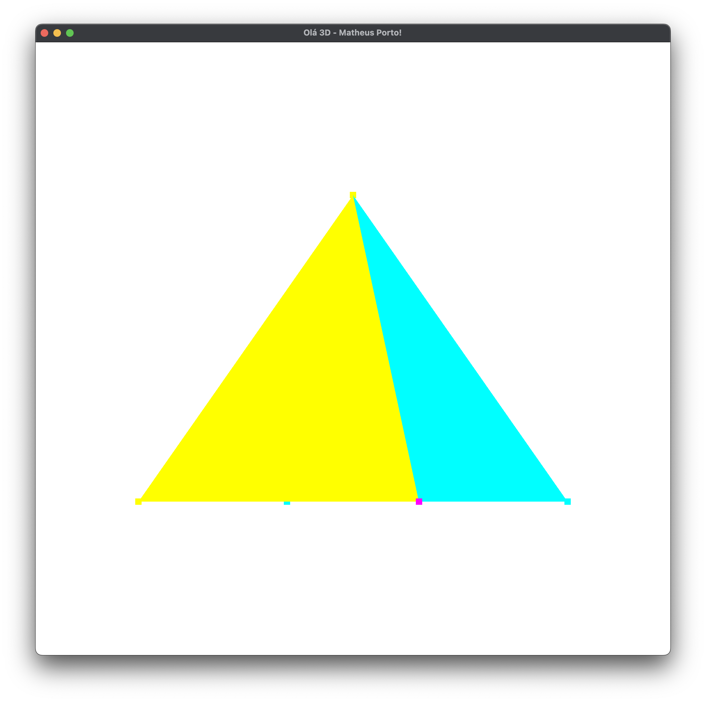

**Objetivo**: o objetivo desta tarefa é que o estudante possa criar o ambiente em que vai realizar as tarefas de programação da Atividade Acadêmica (AA) Computação Gráfica (CG).

O estudante tem a sua disposição o Repositório de Exemplos de código na plataforma GitHub. Estes exemplos podem servir de base para a realização das tarefas propostas, mas seu uso não é obrigatório.

O estudante é livre para escolher o ambiente integrado de desenvolvimento (IDE) de sua preferência, assim como bibliotecas auxiliares para a realização das tarefas, além daquelas sugeridas nos exemplos (dependências). No entanto, a linguagem de programação a ser utilizada deve ser C++ e a interface de desenvolvimento da aplicação (API) gráfica deve ser a OpenGL moderna (versão 3.3+).

 

Instruções de Desenvolvimento

1. Instalar um IDE com suporte a C++. Sugestão: Visual Studio 2022 v. Community - Gratuito
Acessar o repositório de exemplos da disciplina (https://github.com/fellowsheep/CGCCHibrido)
2. Ir no botão verde (Code) e baixar (pode ser com o Download as ZIP, mas pode ser clonando com o git/GithubDesktop)
3. Abrir a solução sln(talvez precise alterar a plataforma destino para x86 (ler instrução do arquivo HELP-SETTINGS.md do repositório)
    - 3.1. Compilar e executar o programa
4. Criar um repositório próprio para fazer as entregas das atividades da AA. Sugere-se a plataforma Github ou similar para tal. Exemplo: github.com/seuUsuario/AtividadesCG.
    - 4.1. Adicione o projeto Hello3D no seu repositório, adaptado conforme seu ambiente.
    - 4.2. Altere, no código, o título da janela para Ola 3D – SeuNome. Não precisa fazer outras alterações de código nesta atividade, mas se desejar, já pode fazer alterações e refatorações que achar pertinentes.

**Print comprovando o funcionamento da implementação:**

