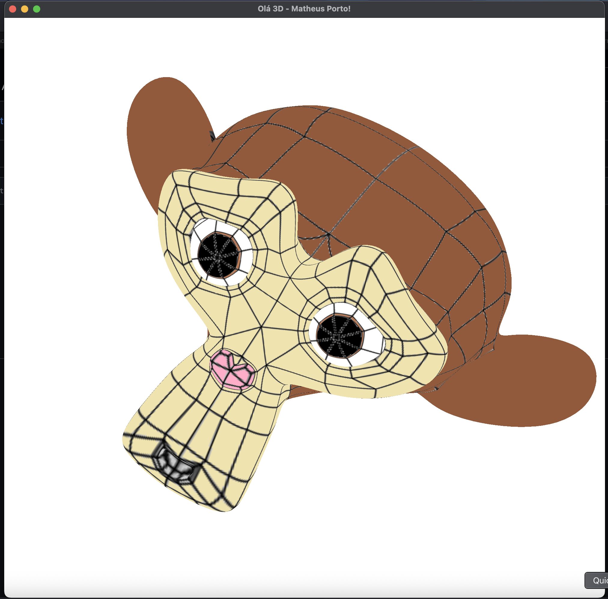

# Descrição da atividade

Dando continuidade ao nosso visualizador, o objetivo desta tarefa é implementar a leitura das coordenadas de texturas presentes no arquivo .OBJ, armazenando-as como atributo dos vértices e as informações sobre a textura contidas no arquivo .MTL (no momento, apenas o nome da textura a ser carregada). Depois disso, você deve seguir o material de apoio para permitir o desenho dos objetos texturizados.

**Print comprovando o funcionamento da implementação:**

[Link para o vídeo da execução](https://github.com/matheusmoraesporto/cg-unisinos-2025/blob/main/m3-textures/m3-textures.mp4)