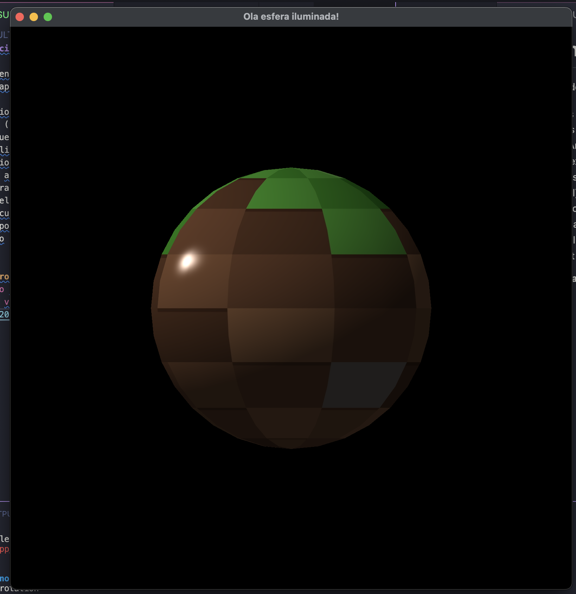

# Tarefa adicionando iluminação

Vamos implementar o modelo de Phong? Para isso, você deve seguir as seguintes etapas:

- É necessário ecuperar as informações dos vetores normais dos vértices no arquivo .OBJ (vn). Teremos então mais um atributo para os vértices da geometria, que devem ser configurados no Vertex Array Object (VAO), no código da aplicação e acrescentados a layout do vértice no vertex shader.
- É necessário recuperar os coeficientes de iluminação ambiente, difusa e especular do arquivo de materiais (.mtl), que serão enviados pela aplicação para o fragment shader, onde calcularemos sua contribuição para a cor do pixel.
- Para o cálculo das parcelas ambiente, difusa e especular do modelo de Phong, você pode consultar o material de apoio, que apresenta um passo-a-passo de como implementar no fragment shader usando a linguagem GLSL.

**Print comprovando o funcionamento da implementação:**

[Link para o vídeo da execução](https://github.com/matheusmoraesporto/cg-unisinos-2025/blob/main/m4-lighting/m4-lighting.mp4)