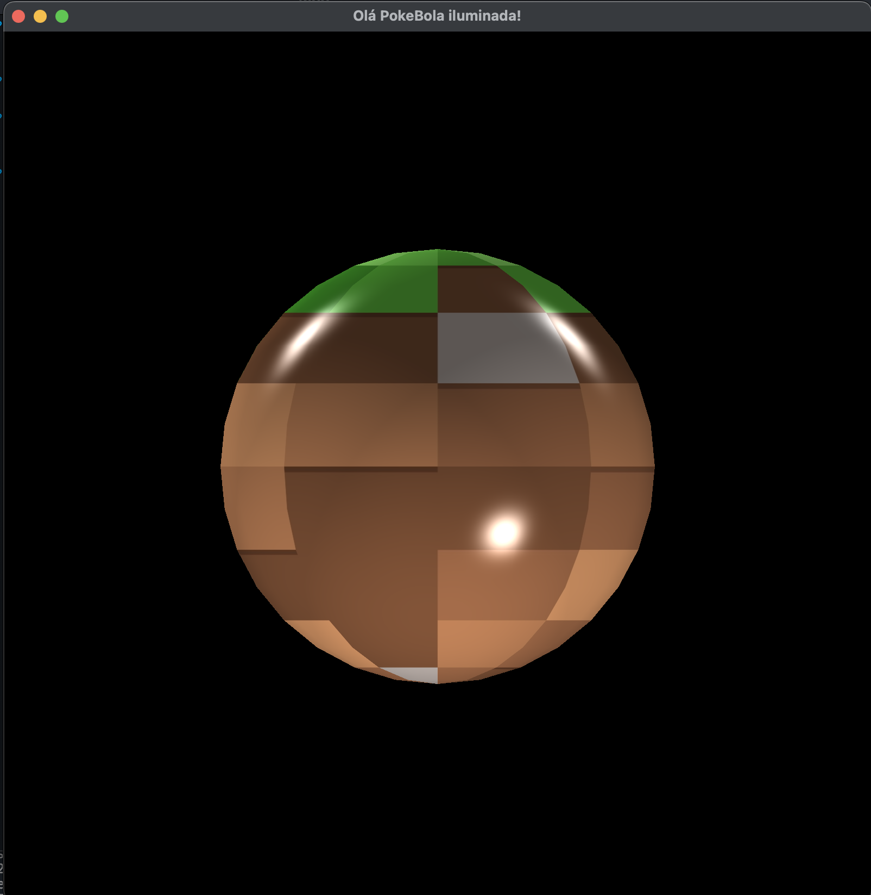
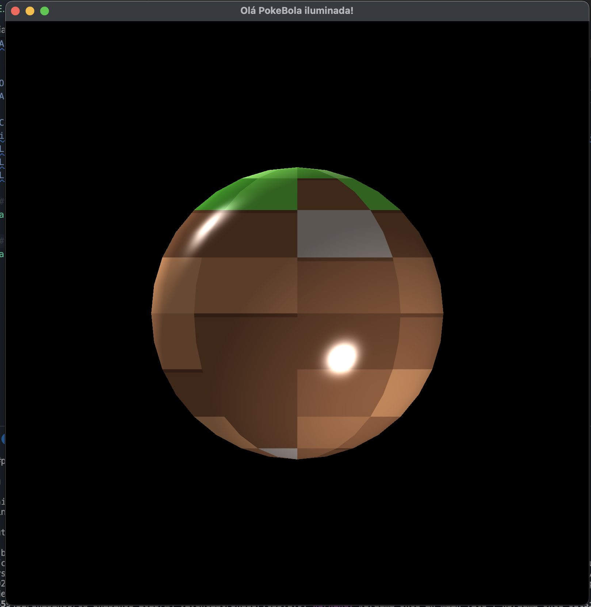
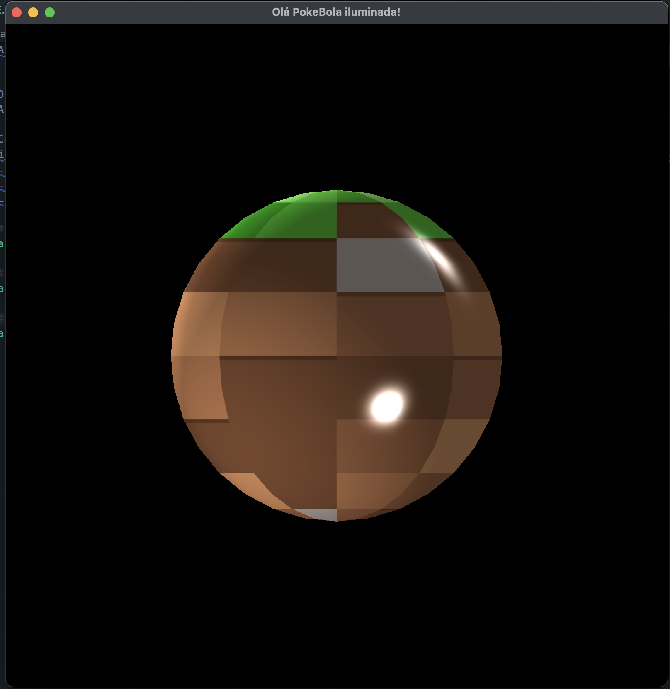
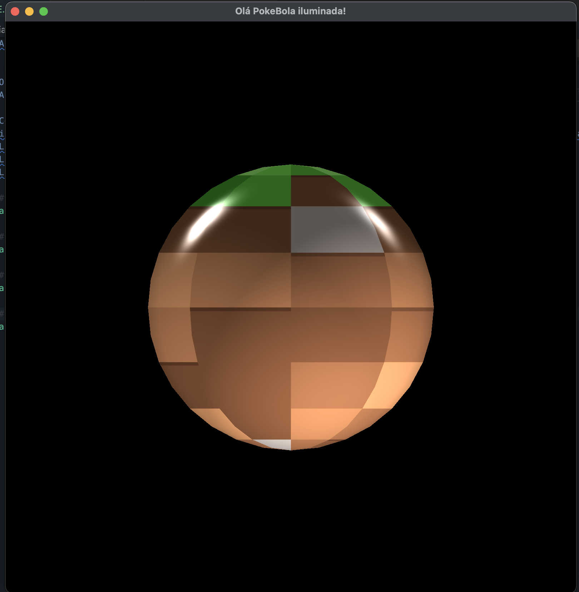
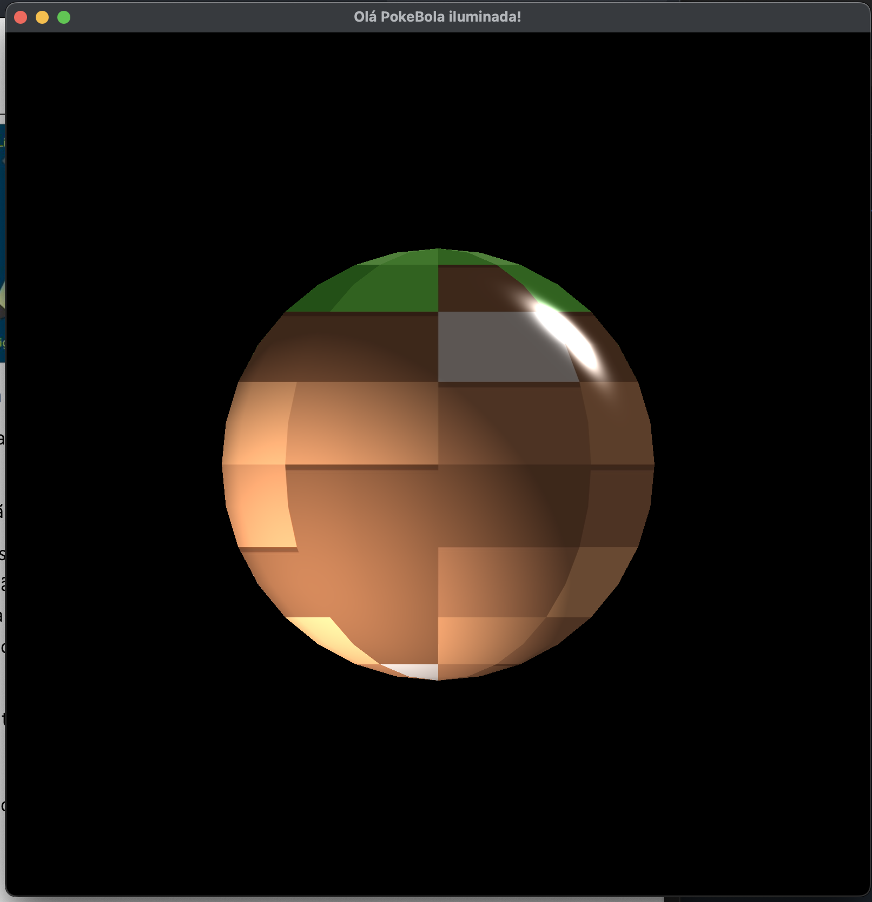
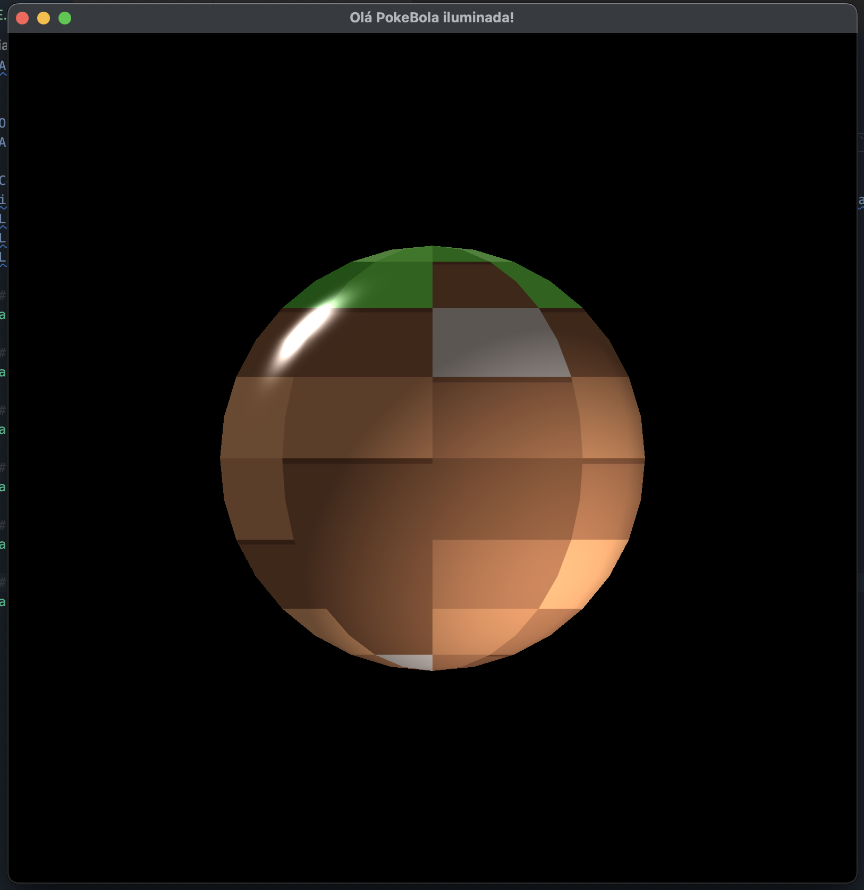
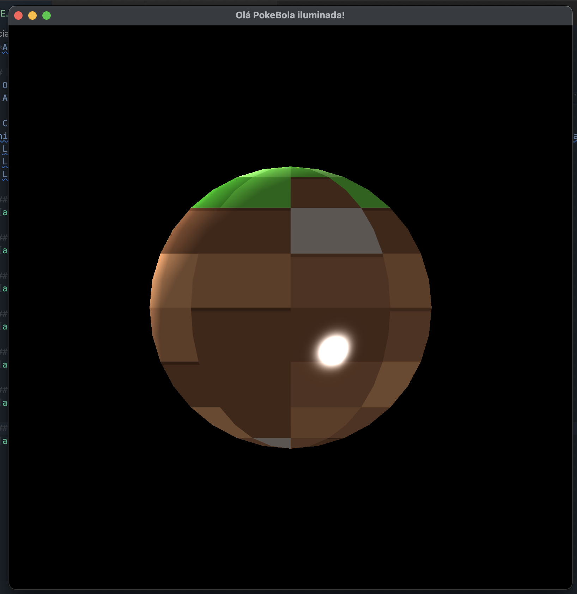
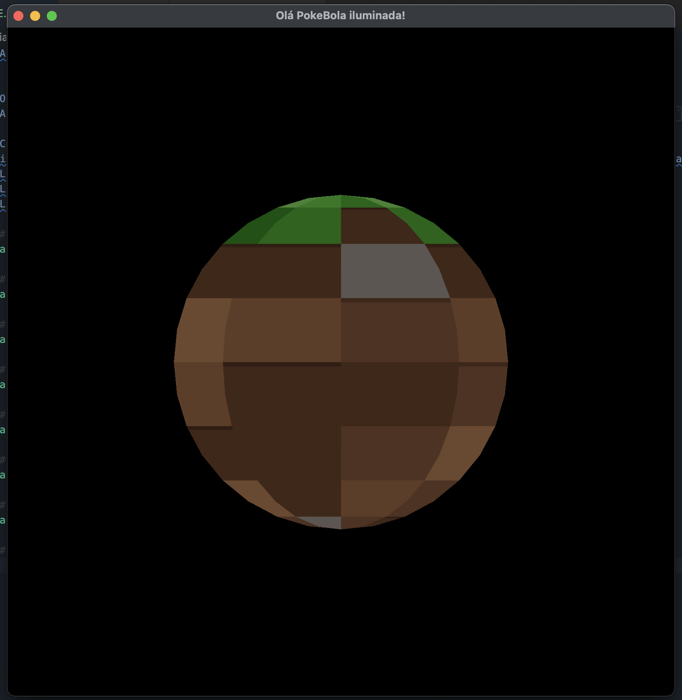

**Alunos:** Matheus Moraes Porto e Jennifer Vargas Diehl

## Pré-requisitos para compilar
- O projeto foi desenvolvido no Mac, utilizando todo o setup definido na README.md da raíz.
- A partir do setup inicial, é necessáiro somente buildar (command + shift + B) e depois executar o arquivo `./app`

# Como interagir com app rodando
Inicialmente o objeto possui todas as luzes ligadas, podemos ligar e desligar elas a qualquer momento, para isto basta:
- Ligar/desligar key light utilizar a tecla `1`
- Ligar/desligar fill light utilizar a tecla `2`
- Ligar/desligar back light utilizar a tecla `3`

### Exemplo com todas as luzes ligadas

### Exemplo com fill light e back light ligadas

### Exemplo com key light e back light ligadas

### Exemplo com key light e fill light ligadas

### Exemplo somente com key light

### Exemplo somente com fill light

### Exemplo somente com back light

### Exemplo com todas as luzes desligadas

